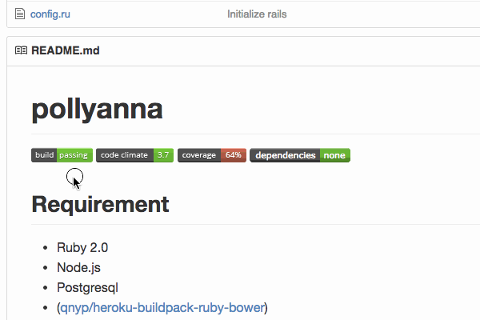
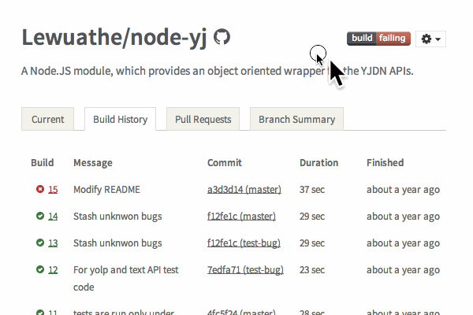
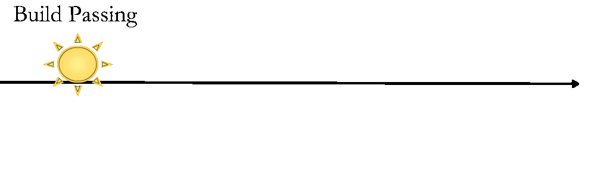

<link href="github-markdown.css" rel="stylesheet">
<link href="page.css" rel="stylesheet">
<link href='http://fonts.googleapis.com/css?family=Lato' rel='stylesheet' type='text/css'>

<script type="text/javascript">
  window.analytics=window.analytics||[],window.analytics.methods=["identify","group","track","page","pageview","alias","ready","on","once","off","trackLink","trackForm","trackClick","trackSubmit"],window.analytics.factory=function(t){return function(){var a=Array.prototype.slice.call(arguments);return a.unshift(t),window.analytics.push(a),window.analytics}};for(var i=0;i<window.analytics.methods.length;i++){var key=window.analytics.methods[i];window.analytics[key]=window.analytics.factory(key)}window.analytics.load=function(t){if(!document.getElementById("analytics-js")){var a=document.createElement("script");a.type="text/javascript",a.id="analytics-js",a.async=!0,a.src=("https:"===document.location.protocol?"https://":"http://")+"cdn.segment.io/analytics.js/v1/"+t+"/analytics.min.js";var n=document.getElementsByTagName("script")[0];n.parentNode.insertBefore(a,n)}},window.analytics.SNIPPET_VERSION="2.0.9",
  window.analytics.load("ig7q6np7c1");
  window.analytics.page();
</script>

### When was the build passing? - A gap between Travis CI and GitHub

その build passingはいつ? - Travis CI とGitHubの間のスキマ



Nice badge: build passing (Travis CI)

build passing(Travis CI)のナイスバッジ

authored on Jul 5, 2013 (captured on Sep 9, 2014)

__a year ago!!!__

These things give us a lot of trouble often.

こういうのがだいたい面倒くさいことになる。

Something awful has happened to you?

面倒くさいことになったことある人?

This paper is http://bit.ly/travis-ci-meetup-tachikoma-io

この資料は http://bit.ly/travis-ci-meetup-tachikoma-io です。

Travis CI is awesome, GitHub is awesome, but there is a gap between them,

Travis CIは神、GitHubも神、でも間にはスキマがあって

I make awesome web application filling this

埋める 神webアプリを作っています。

[Tachikoma.io](http://tachikoma.io)

sanemat

Travis CI Meetup 2014-09-17

<iframe src="http://expando.github.io/add/?u=http%3A%2F%2Fsanemat.github.io%2Ftalks%2F20140917-travis-ci-meetup-tachikoma-io%2F&t=When%20was%20the%20build%20passing%3F" frameborder=0 frametransparency=1 scrolling=no height=30 width=400>
</iframe>

### When was the build failing? Actually 'Now'?

いつ落ちたの? ホントに「今」?

When we use Travis CI and GitHub, It's the story whether any specific programming language or not.

Travis CIとGitHubを使っていると、プログラミング言語問わずよくある話だと思う。



I found the failing test, which is library A's one that I want to use.

使いたいライブラリAのテストが落ちてるぞ。

I watched the result in Travis CI, I understood this.

Travis CI見て、どこが落ちてるかわかったぞ。

I searched the problem. I understood that API requires 'ac' params, this is the problem.

ちょっと調べて、これがAPIの必須パラメーターが足りなくなっていることが原因だとわかった。

I fixed failing test!

テスト落ちてるの直したぞ。

I sent a pull request, but...

プルリクエストを送って、あれ?


WOOOOOO! Fail, Fail, Fail and Fail!

うわぁぁぁぁ。 Fail, Fail, Fail and Fail!



This is about library A's component library dependencies.

これはライブラリAの依存するライブラリの話。

We don't fix the dependency version, this is one of the causes.

依存バージョンを固定していなかったことが原因の一つではある。

It is __not__ a story that, we would have to fix the dependency version.

ただし、依存バージョンを固定してればよかった、という話では __ない__ 。

This library A depends on another library B, and A hits B's bug.

このライブラリAが依存するライブラリBのバグを踏んでいた。

We should update B's version.

なので、依存するライブラリBのバージョンはどうしても上げる必要があった。

We can update v0.1.2 to v0.1.3 easily.

バージョンひとつ上げるならよかった。

Now B's version is v1.2.3, oh. v1 requires bump node.js version.

だけど、その依存ライブラリBを最新版にするにはnode.jsのバージョンを上げる必要があった。

Bump node.js version break A's another dependency library C,

node.jsのバージョンを上げると、別の依存ライブラリCが壊れるので、

(snip)

以下略

The build failing is not __now__ !

壊れたのは __今__ じゃない

Too many tests fail on __now__ pull request. It is difficult to find where should I fix.

__今__ のpull requestではテストが盛大に落ちる、場所の特定も面倒だ。

If I'm at first failing build, then I can find this easily, and fix easily too.

もしこれが、はじめのfailの段階なら、場所を特定するのも簡単。直すのも簡単だった。

## I'm sick of this!

こういうの、うんざりだ! よくある!

I made [Tachikoma.io](http://tachikoma.io), this is awesome application.

神webアプリつくった [Tachikoma.io](http://tachikoma.io)


Interval Pull Request

定期的な Pull Request

What is pros?

何がいいか?

Differences between rebuild via Travis CI API

Travis CIのAPIで、rebuildするのとの違い

When start failing, we can see from Travis CI and GitHub visually.

いつから落ちたか視覚的にTravis CIとGitHubでわかる。

We can see diff between success build and fail one, at GitHub compare view.

落ちたdiffをGitHub上でcompare viewで見ても良い。

We can see the build log at Travis CI.

Travis CIでビルドログを見ても良い。

Leave it to Travis CI is that you can Travis CI.

Travis CIのできることはTravis CIに任せる。

We use Travis CI in combination with Tachikoma.io!

Tachikoma.io と組み合わせて使うのは, Travis CI!

This is not bad app?

なかなかいいでしょう?

(Maybe 4minutes?)

(4分ぐらい?)

## You boast your product, Tachikoma.io?

自分のプロダクト Tachikoma.io の自慢?

Yes!

はい!

I boast our(include you) developers' eco system with Travis CI and GitHub.

これは Travis CIやGitHubといった開発者エコシステムの自慢です。

(Say nice thing)

(うまいこと言った風。)

## One More Thing

おまけ

Specific languages

各言語編

ruby: bundler, perl: carton, node.js: npm, each langualge has own package manager library.

ruby: bundler, perl: carton, node.js: npm と言語ごとにパッケージマネージャーがある。

Gemfile, Gemfile.lock, cpanfile, cpanfile.snapshot, package.json, etc. There are meta file for control dependencies.

Gemfile, Gemfile.lock, cpanfile, cpanfile.snapshot, package.json, etc. と依存関係コントロールするためのメタファイル群がある。

Dependency libraries update hell.

依存関係update hellだ。

This is obvious that only way to survive is updating them frequently.

これはもうこまめにアップデートしていく以外生き延びるすべはないのは確定的に明らか。

Interval `bundle update`(ruby)/ `carton update`(perl) / `david update`(node.js)

定期的に `bundle update` (ruby) / `carton update` (perl) / `david update` (node.js)

```yaml
.tachikoma.yml
strategy: bundler
strategy: carton
strategy: david
strategy: none (default)
```

You can do it with [Tachikoma.io](http://tachikoma.io). Only you should do is putting `.tachikoma.yml`.

それ[Tachikoma.io](http://tachikoma.io)で出来るよ。`.tachikoma.yml`を置くだけでok。

We use Travis CI in combination with Tachikoma.io!!

[Tachikoma.io](http://tachikoma.io) と組み合わせて使うのは, Travis CI!!

## Summary

まとめ

Use [Tachikoma.io](http://tachikoma.io).

[Tachikoma.io](http://tachikoma.io) 使って。

Free for public repositories.

public repos版はFree!

Subscription for private repositories.(I plan)

private repos版は月額有料にしようかと作ってます 価格は予定

- for private $9/mo
- for organization - private $29/mo
- for enterprise sanemat_AT_tachikoma.io

More ideas

さらにアイデアベース

- Show the build log like Travis CI
- ビルドログ見えるようにしよう Travis CIみたいに

- Notify a build completion (and not completion)
- ビルド終わったら(終わらなかったら)notification 飛ばしたい

- Make a badge :)
- badge作りたい

We use Travis CI in combination with Tachikoma.io!!!

Tachikoma.ioと組み合わせて使うのは, Travis CI!!!

This is service statement below:

この下のはサービスステートメントです:

Not updating the dependent libraries, does not damage the library/application immediately.
When adding a new library that you want to use, occurring a security issue in a library which already use, it is extremely difficult to find the right version that functions property with it.
Even if you find the right combination, it's very reactionary and it only gets harder when adding the next one.
Furthermore, sometimes with an older version, you won't be able to enjoy new library features, increase in speed, updated version of Ruby/Node.js/etc., and other benefits.
Ultimately, choosing the latest(stable) combination periodically will keep damages to a minimum.
Everyone knows this, so what's stopping them?

I believe it's due to the lack of tools and integrations.
That is where [Tachikoma.io](http://tachikoma.io) comes in as a beneficial tool.

ライブラリの依存バージョンを上げないことは、すぐにはライブラリやアプリケーションにダメージを与えません。
新しく使いたいライブラリを追加するときに、既存のライブラリにセキュリティフィックスが出たときに、それぞれが正しく動作するバージョンの組み合わせを見つけることは、非常に困難です。
仮に組み合わせを見つけたとしても、すごく後ろ向きですし、次を追加するとき、より困難になって立ちはだかります。
また、ライブラリの新機能、スピードアップ、Ruby/Node.js/etc.のバージョンアップなどメリットを享受するために低いバージョンだとそれが使えないことがあります。
結果的に一番痛みが少ないのは、常に定期的に(安定した)最新版を組み合わせていくことです。
ここまでみんな知ってるしわかってるのに、なぜ出来ない?

それはツールやインテグレーションがまだ不足しているからだ、と私は考えます。
それを埋める1つのパーツがTachikoma.ioです。

We ship to the world!

世界に羽ばたくのでよろしくお願いいたします。

[Tachikoma.io](http://tachikoma.io)

<iframe src="http://expando.github.io/add/?u=http%3A%2F%2Fsanemat.github.io%2Ftalks%2F20140917-travis-ci-meetup-tachikoma-io%2F&t=When%20was%20the%20build%20passing%3F" frameborder=0 frametransparency=1 scrolling=no height=30 width=400>
</iframe>
