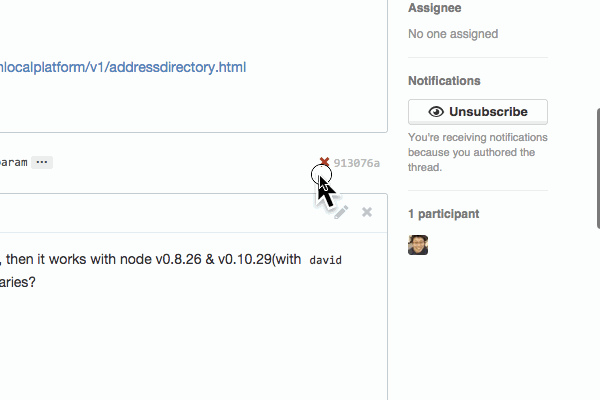

<link href="page.css" rel="stylesheet">
<link href='http://fonts.googleapis.com/css?family=Lato' rel='stylesheet' type='text/css'>

### When was the build passing?

その build passingはいつ?

Nice badge: build passing (Travis CI)

build passing(Travis CI)のナイスバッジ


authored on Jul 5, 2013

__a year ago!!!__

### A gap between Travis CI and GitHub

Travis CI とGitHubの間

This paper is http://bit.ly/travis-ci-meetup-tachikoma-io

この資料は http://bit.ly/travis-ci-meetup-tachikoma-io です。

Travis CI is awesome, GitHub is awesome, but there is a gap between them,

Travis CIは神、GitHubも神、でも間にはスキマがあって

I make awesome web application filling this

埋める 神webアプリを作っています。

[Tachikoma.io](http://tachikoma.io)

sanemat

Travis CI Meetup 2014-09-17

### When was the build failing? Actually 'Now'?

いつ落ちたの? ホントに「今」?

It's the story whether any specific programming language or not.

プログラミング言語問わずよくある話だと思う。


I found the failing test which I want to use.

使いたいライブラリのテストが落ちてるぞ。

I watched the result in Travis CI, I understood this.

Travis CI見て、どこが落ちてるかわかったぞ。

I fixed failing test!

テスト落ちてるの直したぞ。

I sent a pull request, but...

プルリクエストを送って、あれ?



WOOOOOO! Fail, Fail, Fail and Fail!

うわぁぁぁぁ。 Fail, Fail, Fail and Fail!


This is about dependent libraries.

これはライブラリの依存のバージョンの話。

It is __not__ a story that, we would have to fix the dependency version.

依存バージョンを固定してればよかった、という話では __ない__ 。

We hit a bug on some library, so we should update that version.

あるライブラリのバグを踏んでいたので、そのライブラリのバージョンはどうしても上げる必要があった。

That requires updated node.js version.

それを動かすためには、node.jsのバージョンを上げる必要があり、

Updating node.js broke another library.

node.jsのバージョンを上げるには今度は別のライブラリを、

(snip)

以下略

The build failing is __not__ now!

壊れたのは __今__ じゃない

## I'm sick of this!

うんざりだ!

I made [Tachikoma.io](http://tachikoma.io), this is awesome application.

神アプリつくった [Tachikoma.io](http://tachikoma.io)


Interval Pull Request

定期的な Pull Request

Differences between rebuild via Travis CI API

Travis CIのAPIで、rebuildするのとの違い

When start failing, we can see from Travis CI and GitHub visually.

いつから落ちたか視覚的にTravis CIとGitHubでわかる。

Leave it to Travis CI is that you can Travis CI.

Travis CIのできることはTravis CIに任せる

We use Travis CI in combination with Tachikoma.io!

Tachikoma.io と組み合わせて使うのは, Travis CI!

(Maybe 4minutes?)

(4分ぐらい?)

## You boast your product, Tachikoma.io?

自分のプロダクト Tachikoma.io の自慢?

Yes!

はい!

I boast our(include you) eco system with Travis CI and GitHub.

これは Travis CIとGitHubのエコシステムの自慢です。

## One More Thing

おまけ

Specific languages

各言語編

ruby: bundler, perl: carton, node.js: npm, each langualge has own package manager library.

ruby: bundler, perl: carton, node.js: npm と言語ごとにパッケージマネージャーがある。

Gemfile.lock, carton.snapshot, package.json, etc. There are meta file for control dependencies.

Gemfile.lock, carton.snapshot, package.json, etc. と依存関係コントロールするためのメタファイル群がある。

Dependency libraries update hell.

依存関係update hellだ。

This is obvious that only way to survive is update frequently.

これはもうこまめにアップデートしていく以外生き延びるすべはないのは明らか。

Interval `bundle update`(ruby)/ `carton update`(perl) / `david update`(node.js)

定期的に `bundle update` (ruby) / `carton update` (perl) / `david update` (node.js)

You can do it with [Tachikoma.io](http://tachikoma.io). Only you should do is putting `.tachikoma.yaml`.

それ[Tachikoma.io](http://tachikoma.io)で出来るよ。`.tachikoma.yaml`を置くだけでok。

```yaml
.tachikoma.yml
strategy: bundler
strategy: carton
strategy: david
strategy: none (default)
```

We use Travis CI in combination with Tachikoma.io!!

[Tachikoma.io](http://tachikoma.io) と組み合わせて使うのは, Travis CI!!

## Summary

まとめ

Use [Tachikoma.io](http://tachikoma.io).

[Tachikoma.io](http://tachikoma.io) 使って。

public版はFree!

private版は有料にしようかと作ってます 価格は予定

- for private $9/mo
- for organization-private $29/mo
- for enterprise sanemat_AT_tachikoma.io

さらにアイデアベース

- ビルドログ見えるようにしよう
- ビルド終わったら(終わらなかったら)notification 飛ばしたい
- Intervalの頻度を調整できるようにしたい
- badge作りたい

We use Travis CI in combination with Tachikoma.io!!!

Tachikoma.ioと組み合わせて使うのは, Travis CI!!!

ライブラリの依存バージョンを上げないことは、すぐにはライブラリやアプリケーションにダメージを与えません。
新しく使いたいライブラリを追加するときに、既存のライブラリにセキュリティフィックスが出たときに、それぞれが正しく動作するバージョンの組み合わせを見つけることは、非常に困難です。
仮に組み合わせを見つけたとしても、すごく後ろ向きですし、次を追加するとき、より困難になって立ちはだかります。
また、ライブラリの新機能、スピードアップ、rubyのバージョンアップなどメリットを享受するために低いバージョンだとそれが使えないことがあります。
結果的に一番痛みが少ないのは、常に定期的に(安定した)最新版を組み合わせていくことです。
ここまでみんな知ってるしわかってるのに、なぜ出来ない?
それはツールやインテグレーションがまだ不足しているからだ、と私は考えます。
それを埋める1つのパーツがTachikoma.ioです。

世界に羽ばたくのでよろしくお願いいたします。

[Tachikoma.io](http://tachikoma.io)
