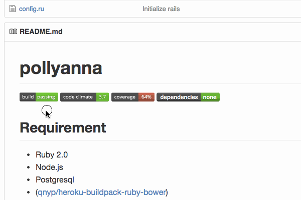

<link href="z.css" rel="stylesheet">
<link href='http://fonts.googleapis.com/css?family=Lato' rel='stylesheet' type='text/css'>

### When does the build pass?
その build passingはいつ?

a year ago

__a year ago__

# Tachikoma.io
sanemat

### When does the build fail? 'Now'?
今落ちたの?

テスト落ちてるの直したぞ
うわぁぁぁぁ
キャプチャ

図

## うんざりだ!

神アプリつくった Tachikoma.io

キャプチャ

Interval Pull Request

Travis CIのAPIで、rebuildするのとの違い

いつから落ちたかTravis CIでわかる

Travis CIのできることはTravis CIに任せる

Tachikoma.io と組み合わせて使うのは,

Travis CI!

(4分ぐらい?)

## One More Thing

各言語編
ruby: bundler, perl: carton, node.js: npm

依存関係コントロール, メタファイル
Gemfile.lock, carton.snapshot, npm-shrinkwrap.json

依存関係update hell

これはもうこまめにアップデートしていく以外生き延びるすべはないのは確定的に明らか

定期的に bundle update (ruby) / carton update (perl) / david update (node.js)

依存ライブラリをアップデート

.tachikoma.yml
strategy: bundler
strategy: carton
strategy: david
strategy: none (default)

Tachikoma.io と組み合わせて使うのは,

Travis CI!!

## まとめ

private版は有料にしようかと作ってます 価格は予定
for private $9/mo
for organization-private $29/mo
for enterprise sanemat_AT_tachikoma.io

アイデアベース
ビルドログ見えるようにしよう
ビルド終わったら(終わらなかったら)notification 飛ばしたい
Intervalの頻度を調整できるようにしたい

Tachikoma.ioと組み合わせて使うのは,

Travis CI!!!

ライブラリの依存バージョンを上げないことは、すぐにはライブラリやアプリケーションにダメージを与えません。
新しく使いたいライブラリを追加するときに、既存のライブラリにセキュリティフィックスが出たときに、それぞれが正しく動作するバージョンの組み合わせを見つけることは、非常に困難です。
仮に組み合わせを見つけたとしても、すごく後ろ向きですし、次を追加するとき、より困難になって立ちはだかります。
また、ライブラリの新機能、スピードアップ、rubyのバージョンアップなどメリットを享受するために低いバージョンだとそれが使えないことがあります。
結果的に一番痛みが少ないのは、常に定期的に(安定した)最新版を組み合わせていくことです。
ここまでみんな知ってるしわかってるのに、なぜ出来ない?
それはツールやインテグレーションがまだ不足しているからだ、と私は考えます。
それを埋める1つのパーツがTachikoma.ioです。

世界に羽ばたくのでよろしくお願いいたします。
Tachikoma.io
