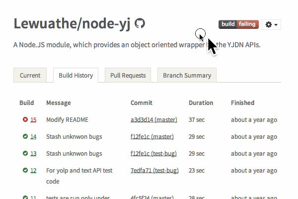
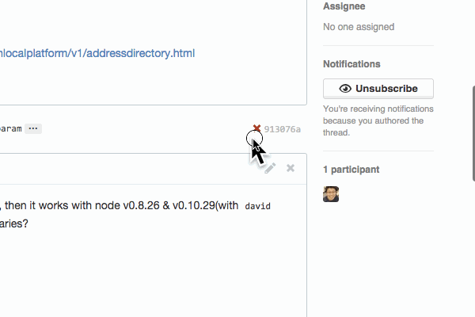
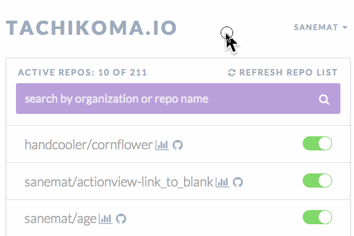

<script type="text/javascript">
  window.analytics=window.analytics||[],window.analytics.methods=["identify","group","track","page","pageview","alias","ready","on","once","off","trackLink","trackForm","trackClick","trackSubmit"],window.analytics.factory=function(t){return function(){var a=Array.prototype.slice.call(arguments);return a.unshift(t),window.analytics.push(a),window.analytics}};for(var i=0;i<window.analytics.methods.length;i++){var key=window.analytics.methods[i];window.analytics[key]=window.analytics.factory(key)}window.analytics.load=function(t){if(!document.getElementById("analytics-js")){var a=document.createElement("script");a.type="text/javascript",a.id="analytics-js",a.async=!0,a.src=("https:"===document.location.protocol?"https://":"http://")+"cdn.segment.io/analytics.js/v1/"+t+"/analytics.min.js";var n=document.getElementsByTagName("script")[0];n.parentNode.insertBefore(a,n)}},window.analytics.SNIPPET_VERSION="2.0.9",
  window.analytics.load("ig7q6np7c1");
  window.analytics.page();
</script>

# Do you use the latest jQuery?

そのjQueryは最新版?

そのまえに

POODLE, ShellShock, HeartBleed, 対応した?

セキュリティフィックスはいつでも出てくる。

jQuery

v1.11.1/v2.1.1(2014-10-15 19:00現在)

`bower install jquery`

bowerかnpmで管理しましょう。npmではofficialには配布してないかも。

e.g. jQuery v1.4

あとで: 例に出したわりに、bowerはbower.lockがv2で入るので、それまではbower対応しない予定。

## When was the build failing? Actually 'Now'?

いつ落ちたの? ホントに「今」?



Travis CIとGitHubを使っていると、プログラミング言語問わずよくある話だと思う。
使いたいライブラリAのテストが落ちてるぞ。
Travis CI見て、どこが落ちてるかわかったぞ。
ちょっと調べて、これがAPIの必須パラメーターが足りなくなっていることが原因だとわかった。
テスト落ちてるの直したぞ。
プルリクエストを送って、あれ?

うわぁぁぁぁ。 Fail, Fail, Fail and Fail!


これはライブラリAの依存するライブラリの話。
依存バージョンを固定していなかったことが原因の一つではある。
ただし、依存バージョンを固定してればよかった、という話では __ない__ 。
このライブラリAが依存するライブラリBのバグを踏んでいた。
なので、依存するライブラリBのバージョンはどうしても上げる必要があった。
バージョンひとつ上げるならよかった。
だけど、その依存ライブラリBを最新版にするにはnode.jsのバージョンを上げる必要があった。
node.jsのバージョンを上げると、別の依存ライブラリCが壊れるので、
以下略
壊れたのは __今__ じゃない
__今__ のpull requestではテストが盛大に落ちる、場所の特定も面倒だ。
もしこれが、はじめのfailの段階なら、場所を特定するのも簡単。直すのも簡単だった。

## I'm sick of this!

こういうの、うんざりだ! よくある!
ここまでの話は他人のライブラリを使う時の話。
おなじことは自分が、ライブラリの提供側・アプリの提供側の時も言える。
まずは、提供側から何とかするぞ!
神webアプリつくった [Tachikoma.io][tachikoma-io]


定期的な Pull Request
何がいいか?
Travis CIのAPIで、rebuildするのとの違い
いつから落ちたか視覚的にTravis CIとGitHubでわかる。
ゆるめのバージョン指定が一番良い。semver...
Travis CIでビルドログを見るとわかる。
Travis CIのできることはTravis CIに任せる。
Tachikoma.ioのできることはTachikoma.ioに任せる。
あなたはあなたのやりたいことをやろう。
だって依存のアップデートがあなたのやりたいことじゃないでしょう? アプリケーション書きたいでしょ!
なかなかいいアプリでしょう?

もう一回。
Tachikoma.ioがしてくれること。
リポジトリのmaster branchに対して、何もせずに、定期的に、Pull Requestを送る。
すると、Travis CIのpass/failで差分に気付く。

## One more thing...

おまけ
何もせずに、定期的に、Pull Requestを送る、と言いました。
各言語編
ruby: bundler, perl: carton, node.js: npm と言語ごとにパッケージマネージャーがある。
Gemfile, Gemfile.lock, cpanfile, cpanfile.snapshot, package.json, etc. と依存関係コントロールするためのメタファイル群がある。
これらは依存関係update hellだ。
これはもうこまめに定期的に最新安定版にアップデートしていく以外生き延びるすべはないのは確定的に明らか。
定期的に `bundle update` (ruby) / `carton update` (perl) / `david update` (node.js)
やってますか? やってないでしょ? やってる? もっと簡単になるよ。
それ[Tachikoma.io][tachikoma-io]で出来るよ。`.tachikoma.yml`を置くだけでok。

```yaml
.tachikoma.yml
strategy: bundler
strategy: carton
strategy: david
strategy: none (default)
```

定期的に `bundle update`してTachikoma.ioからpull requestが来る。
この場合、Travis CI のbuildログだけでなく、GitHubのcompare viewも頼りになる。
Tachikoma.ioのできることはTachikoma.ioに任せる。
あなたはあなたのやりたいことをやろう。

## Summary

public repos版はFree!
private repos版は月額有料です

- [for private individual $9/mo ~~$19~~](https://gumroad.com/l/JwtkV/travisci)
- [for private organization $49/mo](https://gumroad.com/l/oDPx)
- for enterprise
    - email: sanemat {AT} tachikoma.io

## This is service statement below

この下のはサービスステートメントです:

ライブラリの依存バージョンを上げないことは、すぐにはライブラリやアプリケーションにダメージを与えません。
新しく使いたいライブラリを追加するときに、既存のライブラリにセキュリティフィックスが出たときに、それぞれが正しく動作するバージョンの組み合わせを見つけることは、非常に困難です。
仮に組み合わせを見つけたとしても、すごく後ろ向きですし、次を追加するとき、より困難になって立ちはだかります。
また、ライブラリの新機能、スピードアップ、Ruby/Node.js/etc.のバージョンアップなどメリットを享受するために低いバージョンだとそれが使えないことがあります。
結果的に一番痛みが少ないのは、常に定期的に(安定した)最新版を組み合わせていくことです。
ここまでみんな知ってるしわかってるのに、なぜ出来ない?

それはツールやインテグレーションがまだ不足しているからだ、と私は考えます。
それを埋める1つのパーツがTachikoma.ioです。

[Tachikoma.io][tachikoma-io]

sanemat {AT} tachikoma.io

## The progress

9/17のtravis ci meetupのLTで公にお披露目。
9/18-9/20のはてなブックマーク効果、130 accounts。
hacker newsで+10, プラスアルファで現在2014-10-15 19:23 145。
private reposの有料アカウント 0。
pull requestから人が集まる妄想してたけど、今のところそんなことは起きてない。
1件だけ。しかも未対応のpython… [Exec tachikoma update 20140918181203 by tachikomapocket Pull Request #172 kawazrepos/Kawaz3rd](https://github.com/kawazrepos/Kawaz3rd/pull/172)
甘くないなー
影響力のある人/プロダクトに使ってもらう(?) ちょっと博打的発想。
課金->使用ではなく、1mo無料->課金 にした方がいいかも。(小手先)
別のマネタイズ? テストやライブラリの統計・解析・分析など

仮説

`bundle update`で日々バージョンを上げていくことが大事だとわかっている企業/個人は、もう内部でその仕組を持っている(?)
必要だと思った人は内製してそう。e.g. Quipper などもとのtachikoma gem ユーザー。
Rails界隈以外はそんなにアップデートで死んでない。
この仕組に載せるまで、まず最新に追いつくところ、が職人芸なので、そこを何とかしたら良い?? しなければいけない?
定期的にクリーンな環境から何かを提供するaggregatorになる? travis-ci, circle ciのアドオン提供など?

<iframe src="http://expando.github.io/add/?u=http%3A%2F%2Fsanemat.github.io%2Ftalks%2F20141015-library-dependencies-update%2F&t=Do%20you%20use%20the%20latest%20jQuery%3F" frameborder=0 frametransparency=1 scrolling=no height=30 width=400>
</iframe>

[tachikoma-io]:http://tachikoma.io/?utm_source=talk&utm_medium=slide&utm_campaign=20141015-library-dependencies-update
