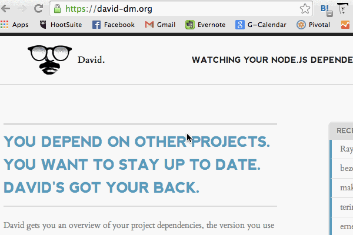
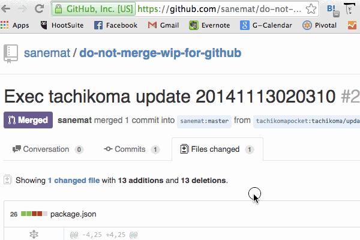

# Dependency Hell

sanemat - sanemat {AT} tachikoma.io

Tokyo Node Fest 2014-11-15

ぼくはまだ今作っているwebサービスが、AngularJS v1.2を使っていて、いつv1.3に上げようか考えてる

* Bootstrap v3.3.1, v3.3.0, v3.2.0, v3.1.1, v3.0.3, v2.3.2, ...
* jQuery v2.1.1, v1.11.1, v1.11.0, v1.10.2, v1.9.1, v1.8.3, v1.7.2, ...
* AngularJS v1.3.2, v1.2.26, v1.1.5, v1.0.8, ...

さらに、ポンと直接置いてあるJavaScriptライブラリが!!

## TL;DR

先に結論から言うと、一番痛みが少ないのは、「常に定期的に(安定した)最新版を組み合わせていくこと」

## Use Package Manager

JavaScriptライブラリをポンと置くのは止めよう
npm, npm + browserify, bower など

### バージョンアップつらい?

依存のアップデート好きな人?

そのままがんばってください!

そうじゃない人?

依存のアップデートがあなたのやりたいことじゃないでしょう? アプリケーション書きたいでしょ!

### つらさの少ない方法

そして、意識高くなくても「定期的に」「継続して」アップデートできる仕組みを入れよう

意識高い時は出来る!

意識低い時でも、Mergeボタン押すだけまでお膳立てしてもらえれば出来る。

Pull Requestが来てMergeするだけ!

神webサービス作った。

## David Update as a Service

### Tachikoma.io

* GitHub連携
* リポジトリのToggleをON
* `david update`
* 定期的にPull Requestが来る
* (TravisCI, CircleCI, Werckerなどがあれば)テストが走る
* Merge or Fix

### What is David?

davidは作ってない :(

Check dependency update.

And CLI `david update`

Tachikoma.ioなかなかいいアプリでしょう?

もう一回。

Tachikoma.ioがしてくれること。

* リポジトリのmaster branchに対して、
* `david update`して、
* 定期的に、Pull Requestを送る。
* すると、CIサービスなどのpass/failで差分に気付く。

### まとめ

Tachikoma.ioで楽できるなら楽しよう。

あなたはあなたのやりたいことをやろう。

## Future

* みんなでGitHubのdiff見に行くの意味ないからなんとかする
* 最新版まで持ってくるのが出来ればあとはそうでもないんだよ! はい…
* バージョン上げても大丈夫と保証してほしい む…
* npm shrinkwrap 対応
* bower.lock, bower shrinkwrap はやくきてくれー bower v2.0 来たら対応する

## Summary

It is free for public repositories, however, requires monthly subscription for private repositories.

- [for private individual $9/mo ~~$19~~](https://gumroad.com/l/JwtkV/travisci)
- [for private organization $49/mo](https://gumroad.com/l/oDPx)
- for enterprise
    - email: sanemat {AT} tachikoma.io

## This is service statement below

Not updating the dependent libraries, does not damage the library/application immediately.
When adding a new library that you want to use, occurring a security issue in a library which is already in use, it is extremely difficult to find the right version that functions properly with it.
Even if you find the right combination, it's very reactionary and it even gets harder when adding the next one.

Furthermore, sometimes with an older version, you won't be able to enjoy new library features, increase in speed, updated version of Ruby/Node.js/etc., and other benefits.

Ultimately, choosing the latest(stable) combination periodically will keep damages to a minimum.

Everyone knows this, but what's stopping them?

I believe it's due to the lack of tools and integrations. That is where Tachikoma.io comes in.

この下のはサービスステートメントです:

ライブラリの依存バージョンを上げないことは、すぐにはライブラリやアプリケーションにダメージを与えません。
新しく使いたいライブラリを追加するときに、既存のライブラリにセキュリティフィックスが出たときに、それぞれが正しく動作するバージョンの組み合わせを見つけることは、非常に困難です。
仮に組み合わせを見つけたとしても、すごく後ろ向きですし、次を追加するとき、より困難になって立ちはだかります。
また、ライブラリの新機能、スピードアップ、Ruby/Node.js/etc.のバージョンアップなどメリットを享受するために低いバージョンだとそれが使えないことがあります。
結果的に一番痛みが少ないのは、常に定期的に(安定した)最新版を組み合わせていくことです。
ここまでみんな知ってるしわかってるのに、なぜ出来ない?

それはツールやインテグレーションがまだ不足しているからだ、と私は考えます。
それを埋める1つのパーツがTachikoma.ioです。

[Tachikoma.io][tachikoma-io]

sanemat {AT} tachikoma.io

<iframe src="http://expando.github.io/add/?u=http%3A%2F%2Fsanemat.github.io%2Ftalks%2F20141115-dependency-hell%2F&t=Dependency%20Hell%20%2F%202014%20Tokyo%20Node%20Fest" frameborder=0 frametransparency=1 scrolling=no height=30 width=300>
</iframe>

[tachikoma-io]:http://tachikoma.io/?utm_source=talk&utm_medium=slide&utm_campaign=20141115-dependency-hell
