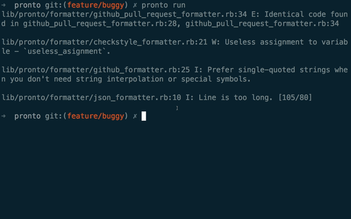
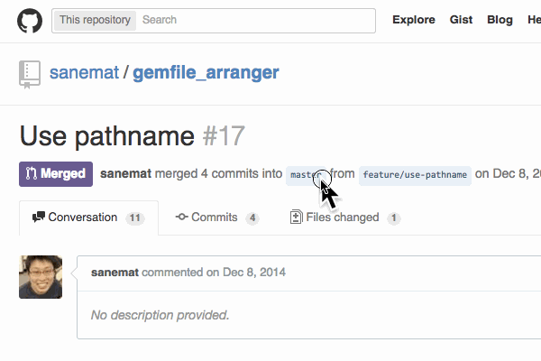

<script type="text/javascript">
  window.analytics=window.analytics||[],window.analytics.methods=["identify","group","track","page","pageview","alias","ready","on","once","off","trackLink","trackForm","trackClick","trackSubmit"],window.analytics.factory=function(t){return function(){var a=Array.prototype.slice.call(arguments);return a.unshift(t),window.analytics.push(a),window.analytics}};for(var i=0;i<window.analytics.methods.length;i++){var key=window.analytics.methods[i];window.analytics[key]=window.analytics.factory(key)}window.analytics.load=function(t){if(!document.getElementById("analytics-js")){var a=document.createElement("script");a.type="text/javascript",a.id="analytics-js",a.async=!0,a.src=("https:"===document.location.protocol?"https://":"http://")+"cdn.segment.io/analytics.js/v1/"+t+"/analytics.min.js";var n=document.getElementsByTagName("script")[0];n.parentNode.insertBefore(a,n)}},window.analytics.SNIPPET_VERSION="2.0.9",
  window.analytics.load("ig7q6np7c1");
  window.analytics.page();
</script>

# Saddler - better pronto



これはprontoのデモ画面です!!

Saddlerというライブラリ群を作成中。こんなのあればいいのに、とかいろいろ募集。

## Rubocop


デフォルト設定があるが、`.rubocop.yml`で全部設定変更できる

* [rubocop](https://github.com/bbatsov/rubocop)

## HoundCI



e.g. [Use pathname](https://github.com/sanemat/gemfile_arranger/pull/17)

pull requestにコメントしてくる。内容は, rubocop, coffeelint, jshint, scss-lint
`.rubocop.yml`は尊重、ただし、rubocopデフォルト設定を thoughtbotルールで上書きしてる

* [HoundCI](https://houndci.com/)
* [thoughtbot/hound](https://github.com/thoughtbot/hound)

## Pronto


```
$ pronto run -f github -c origin/master
```

```
$ GITHUB_ACCESS_TOKEN=token PULL_REQUEST_ID=id pronto run -f github_pr -c origin/master
```

対応runner

* pronto-brakeman
* pronto-coffeelint
* pronto-flay
* pronto-foodcritic
* pronto-jshint
* pronto-haml
* pronto-poper
* pronto-rails_best_practices
* pronto-reek
* pronto-rubocop
* pronto-scss
* pronto-spell

対応reporter

* checkstyle
* github
* github pull request
* gitlab
* json
* text

* [mmozuras/pronto](https://github.com/mmozuras/pronto)

## Saddler

* [packsaddle/ruby-saddler](https://github.com/packsaddle/ruby-saddler)
* [packsaddle](https://github.com/packsaddle)

```
git diff -z --name-only origin/master.. \
 | xargs -0 bundle exec rubocop-select \
 | xargs rubocop \
     --require rubocop/formatter/checkstyle_formatter \
     --format RuboCop::Formatter::CheckstyleFormatter \
 | checkstyle_filter-git diff origin/master.. \
 | saddler run \
     --require github/pull-request-comment-formatter \
     --format Github::PullRequestCommentFormatter
```

```
$ git diff -z --name-only b5ee3a61...origin/master
.gitignore^@.rubocop.yml^@.travis.yml^@Gemfile^@README.md^@bin/console^@bin/setup^@checkstyle_filter-git.gemspec^@example/example1.xml^@example/github-pull-requests-files-response.json^@example/invalid.rb^@exe/checkstyle_filter-git^@lib/checkstyle_filter/git.rb^@lib/checkstyle_filter/git/cli.rb^@lib/checkstyle_filter/git/diff_parser.rb^@

$ git diff -z --name-only b5ee3a61...origin/master \
 | xargs -0 rubocop-select
/Users/sane/work/ruby-study/checkstyle_filter-git/checkstyle_filter-git.gemspec
/Users/sane/work/ruby-study/checkstyle_filter-git/Gemfile
/Users/sane/work/ruby-study/checkstyle_filter-git/bin/console
/Users/sane/work/ruby-study/checkstyle_filter-git/example/invalid.rb
/Users/sane/work/ruby-study/checkstyle_filter-git/exe/checkstyle_filter-git
/Users/sane/work/ruby-study/checkstyle_filter-git/lib/checkstyle_filter/git/cli.rb
/Users/sane/work/ruby-study/checkstyle_filter-git/lib/checkstyle_filter/git/diff_parser.rb
/Users/sane/work/ruby-study/checkstyle_filter-git/lib/checkstyle_filter/git.rb

$ git diff -z --name-only b5ee3a61...origin/master \
 | xargs -0 rubocop-select \
 | xargs rubocop \
     --require rubocop/formatter/checkstyle_formatter \
     --format RuboCop::Formatter::CheckstyleFormatter
<?xml version='1.0'?>
<checkstyle>
  <file name='/Users/sane/work/ruby-study/checkstyle_filter-git/checkstyle_filter-git.gemspec'/>
  <file name='/Users/sane/work/ruby-study/checkstyle_filter-git/Gemfile'/>
  <file name='/Users/sane/work/ruby-study/checkstyle_filter-git/bin/console'/>
  <file name='/Users/sane/work/ruby-study/checkstyle_filter-git/example/invalid.rb'>
    <error line='3' column='100' severity='info' message='Line is too long. [188/100]' source='com.puppycrawl.tools.checkstyle.Metrics/LineLength'/>
  </file>
  <file name='/Users/sane/work/ruby-study/checkstyle_filter-git/exe/checkstyle_filter-git'/>
  <file name='/Users/sane/work/ruby-study/checkstyle_filter-git/lib/checkstyle_filter/git/cli.rb'>
    <error line='14' column='6' severity='info' message='Assignment Branch Condition size for diff is too high. [54.73/15]' source='com.puppycrawl.tools.checkstyle.Metrics/AbcSize'/>
(snip)

$ checkstyle_filter-git diff b5ee3a61...origin/master

$ saddler run \
  --require github/pull-request-comment-formatter \
  --format Github::PullRequestCommentFormatter
```

### pronto dis

え、prontoでいいじゃん、足りないところあればコントリビューションすればいいじゃん

pronto自体の出来はよい、but 確認しづらいパーツが多すぎる

ruggedとか、gitlabとか、今はないけどbitbucketとか
git diff相当でinvalid byte sequenceで落ちる

余談
ruggedはlibgit2のrubyバインディングなんだけど、普通にwrapper
たとえば、cliの `git diff` ってめちゃめちゃいろいろなことやる
ちょっとウソ言ってるかもだから補足お願い

`git diff`: HEAD..index
`git diff FILE_A FILE_B`: FILE_A FILE_Bの HEAD..index
`git diff origin/master`: origin/master..index
`git diff origin/master..HEAD`:

おれはいますぐgit diffの結果がほしいんだ! という場合には、難しい、でも他の選択肢ない
`checkstyle_filter-git` では、gitライブラリいろいろ試した結果、`open3.capture3`
libgit2は当然中のmappingだから、ruggedもだいたい、中のmappingと一緒

pronto-何か間の ラッパー頑張ってるけど、イマイチ
対象とするファイルの抜き出しとか、不満がある

それからラッパーないものとか、別言語とか

diff部分だけのlint 各ライブラリの内部メソッドを呼び出す必要がある
diff部分だけをlint これは別のlint作者(vimlint)からの着想だけど、ファイルをやって、プラス分だけやれたほうがいい
たとえば、javascript で `var` で変数宣言してる行を削った場合、など増分diffのlintだけでは出てこない

増分diffの範囲になければ無理だけど！
ちょっと、これは後で考える、github pull request commentに引きずられ過ぎかもしれない

### houndci dis

rubyでwrapperライブラリあるものに今は絞ってる
jsのライブラリをgemにしたものってオワコン
めっちゃはやい、github pull requestのdiff filesから取得
ただし、反対にそれによる制約も出てくる

### saddler

* travis-ci, circle-ciでサクサク動く(はず)
* パイプで挟んで伝達できれば、なんでもできる(はず)
* 独自フォーマットをできるだけ避ける
    * saddlerはcheckstyleを受け取る予定
    * checkstyle formatに変換さえすれば、何でもできる(はず)
* jscsとかeslintとか、tslintとか、行けるようになるんだ たぶん

### 今すぐためしてみたい!

やっと昨日 saddlerコマンド作り始めたので、もうちょっとお待ちを。
gemとnpmのsaddlerって名前だけ押さえた。

```
git diff -z --name-only origin/master.. \
 | xargs -0 bundle exec rubocop-select \
 | xargs rubocop \
     --require rubocop/formatter/checkstyle_formatter \
     --format RuboCop::Formatter::CheckstyleFormatter \
 | checkstyle_filter-git diff origin/master.. \
 | saddler run \
     --require github/pull-request-comment-formatter \
     --format Github::PullRequestCommentFormatter
```

rubyとnodejsは書くけど、本当はgolangでポン置き出来るようにしたい。

出来るのかは知らない。

## Question

### saddlerって何?


reporter から派生して、荷馬車とか駄獣とかハコブネとか、なんかそういう荷物を運んで運搬するイメージ

```
x reporter
x journalist
x gazette
x newsletter
x bearer
x herald
x steel
x saddle
x packhorse
```

ruby gemとnode npmで使えて、コマンド名にもなる

候補
* packsaddle
* saddles
* saddler
* saddlery

で、saddler

saddle(馬具)を売る人がsaddler。reporterとは関係なくなった(?) saddler が run なのか? まあいい、のか?
ちなみに sadler's wells (ロンドンのバレエ劇場, 競走馬)、とはdの数1個違う

[Tachikoma.io][tachikoma-io]

sanemat {AT} tachikoma.io

<iframe src="http://expando.github.io/add/?u=http%3A%2F%2Fsanemat.github.io%2Ftalks%2F20150217-shibuya-rb-saddler%2F&t=Saddler%20-%20better%20pronto%20%2F%20Shibuya.rb" frameborder=0 frametransparency=1 scrolling=no height=30 width=300>
</iframe>

[tachikoma-io]:http://tachikoma.io/?utm_source=talk&utm_medium=slide&utm_campaign=20150217-shibuya-rb-saddler
