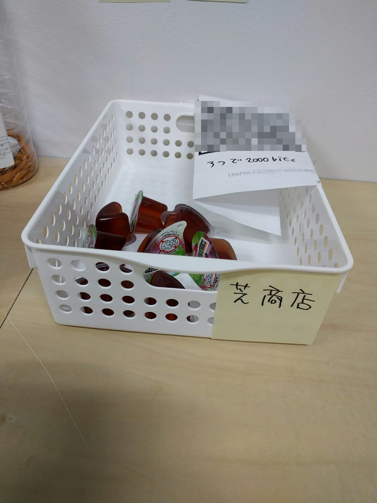
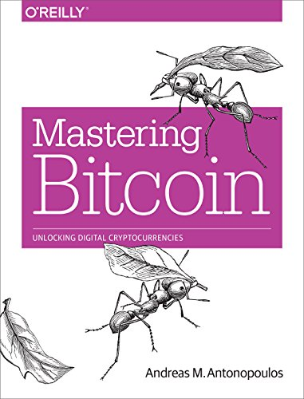

# Build internal shop

sanemat {AT} tachikoma.io

bitcoin専門社内おやつ商店 芝商店

## Mastering bitcoin

[ビットコインとブロックチェーン:暗号通貨を支える技術](https://www.amazon.co.jp/dp/4757103670)

- 名前聞いたことある人
- 読んでみた人
- 訳してみた人
- 読んでみたい人

[Translations of Mastering Bitcoin](https://www.bitcoinbook.info/translations-of-mastering-bitcoin/)

CC BY-SA

[ビットコインとブロックチェーン:暗号通貨を支える技術](https://www.amazon.co.jp/dp/4757103670)

日オライリーから出てるかと思って探したんだけどなくて、エヌティティ出版からなのね。

## 疑問点

読んでいろいろわかんないわけですね。

感想探してみた。

- [Mastering Bitcoin（日本語訳 PDF）を読んで解決した疑問点、しなかった疑問点 - 無印吉澤](http://muziyoshiz.hatenablog.com/entry/2016/02/25/011117)

web屋っぽい 近いところにいるはずなのに俺より全然レベルたけーな おれもっといろいろわかんなかった…

## 自分の興味

よく決済手数料が激安に済むとか中央で通貨管理しなくていいとか聞くけど、実際どうで現状どうか

## 社内おやつ商店

bitcoin専門

## 結果

- 面白がって買ってくれる人が社内に自分以外に2人いた
- bitcoinを買ったことある人はいてもmobileウォレット誰ももってねえ
- 紙のQRコードの読み取り性能がだいぶつらい
    - これは自分の問題か
- 紙だから1個のアドレスを使い回すはめになり、アドレスと人がひも付きやすい 匿名性とは
    - これそのまんま1個のアドレスを使い回す危険性の話
- blockchain.info のurlを貼ってくれた方がいて、明朗経営が実現
- bitcoinで仕入れらんねえ
    - そこで[コインギフト | モナーコイン・ビットコインでAmazonギフト券・iTunesカードが買える！](https://coingift.jp/) ですよ
    - おっそうだな
- 自分のクレカで仕入れて、商店のウォレットから自分のウォレットに送信
- 商店のウォレットは自分で管理かあ
- HD walletにして拡張公開鍵だけ入れておけば送金できないかと思ったら、送金の依頼っぽいリクエストが出せる(後述)
- モバイルアプリのトランザクションフィー、アプリにも依るが最低限よりだいぶ高い
- 十数円、数十円の決済には向かねーな
    - ユーザーが手数料決めるって構造の課題なのかも
    - 普段決済手数料意識することない 銀行の振込手数料はなんかいろいろ駆使して無料の範囲で収める

## 学び

- 実際にどういう流れでどういう処理が行われるか
- transactionの各項目の意味がなんとなくわかる
- モバイルアプリの使い勝手
- 何が公開してよくて何が公開していけない情報なのか

## おもしろ

- 自分で仕入れてきてほぼ自分で買う羽目になった
- 既存の社内商店のとなりに陣取ったので、弊商店からおやつをとって既存の商店に入金する事案
- 薬局で買ってボッタクリで売ったので店自体は黒字 ほぼ自分で買ったので実情は???
- 新たなライバル商店の出現

<iframe src="http://expando.github.io/add/?u=http%3A%2F%2Fsanemat.github.io%2Ftalks%2F20150217-shibuya-rb-saddler%2F&t=Saddler%20-%20better%20pronto%20%2F%20Shibuya.rb" frameborder=0 frametransparency=1 scrolling=no height=30 width=300>
</iframe>

[tachikoma-io]:http://tachikoma.io/?utm_source=talk&utm_medium=slide&utm_campaign=20150217-shibuya-rb-saddler
