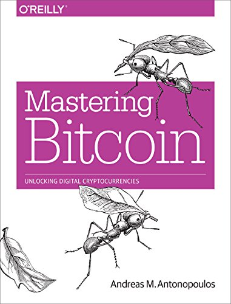

# ツールを作りかけたのでわかるbitcoin HD Walletのしくみ

sanemat {AT} tachikoma.io

- Hierarchical Deterministic Wallet 階層的決定性ウォレット
- BIP0032/BIP0044

## これはなに

- WalletのUXTO (未使用残高)をwallet実装無しで計算するツールを作ろうとした
- 現在進行形で作りかけ
- 結論は「既存のWalletを使え」なんだけど、
そのツールを作る過程でbitcoin HD Walletのしくみを理解してきたので、まとめました

__あやふやなところもあるからわかりにくかったら突っ込んでね__

## アドレスの固定

さっきbitcoin専門社内おやつ商店の話で、1アドレスを紙に書いてしまった話をした。

### アドレスは使い捨てにする

- ビットコインアドレスって、使い捨てにしたほうがいい。
- こちらの取引金額なんてバレてもいーじゃんってはじめは思う。
- こちらのセキュリティ的な話。
- 相手のセキュリティ的な話。
- 51%攻撃受けやすくなる。
    - transactionをpoolに入れたり、blockの中だったりでゴニョゴニョしうる余地を産んでしまう

- 表示側もワンタイム生成のアプリにすべきですな。

## WalletのUXTO (未使用残高)をwallet実装無しで計算するツール

- なぜwallet実装無しでやりたかった?
- 着金したかどうかってどうやってわかるんじゃろう
- 残高どうやって出そう
- wallet使えばいいじゃん
- HD Walletにして、拡張公開鍵だけ入れておけばいいのでは?
    - 一見良さそうに見えた。

### 送金依頼のような

- アプリ側の実装によるのかもしれないが、copay androidアプリからだと、拡張公開鍵だけで送金「依頼」のようなものが出せた。
- wallet client側の見た目の数字は減って、秘密鍵を持っているアプリに、「この送金をverifyしますか y/n」のようなダイアログが出て、yを押したら送金処理になった。
- もちろんnを押したり、無視したりすれば送金されないが、ちと、ちと。

## HD Walletと BIP0032/BIP0044の説明

HD wallet(Hierarchical Deterministic Wallet) 階層的決定性ウォレット

mastering bitcoinを読むか、BIP0032/BIP0044直接読んでくれ! 以上

## ウォレット
- 公開鍵の別表現がビットコインアドレス
- 秘密鍵をどう持つか/作るか、のはなし

### ランダムウォレット(非決定性ウォレット)

- ウォレットはランダム生成した秘密鍵の束

### 決定性ウォレット

ウォレットで共通のseedから一方向ハッシュで秘密鍵生成

### HD wallet(Hierarchical Deterministic Wallet)

13個のmnemonic codeからseedを作成
seedからmaster key生成、そこからツリー上にchild keys, grandchild keys と生成

(mastering bitcoinからコピペ)

> 1. ツリー構造に情報付加できる

keyのpath こんなやつ
`Bitcoin	second	change	second	m / 44' / 0' / 1' / 1 / 1`

> 2. ユーザーが秘密鍵に触れることなく公開鍵を生成できる

ビットコインアドレスを作れる、と同じ意味合い

## 気になるところ

> 拡張公開鍵がchain codeを含んでいる

拡張公開鍵って「公開鍵」って言いつついろいろ出来てしまうので、ふつうにsshの公開鍵みたいに全世界に公開していいの?
って問題意識とも関連してくるんだけど

> 拡張公開鍵はchain codeを含んでいるため、もし子秘密鍵が知られているまたは漏洩してしまった場合、
このchain codeを使ってその他すべての子秘密鍵を導けてしまう
> このリスクへの解決策として、HDウォレットは hardened child key derivation 強化子公開鍵導出 関数を使っている
> もし拡張公開鍵の利便性を使い、しかもchain codeの漏洩リスクを回避したいのであれば、通常の親(親公開鍵)ではなく、
> 強化された親(親秘密鍵)から拡張公開鍵を導出すべきです。
> ベストプラクティスとしては、マスターキーの1階層目の子供を常にhardened derivationを通して導出されるようにしておくことが良いでしょう。

なんか小さくベストプラクティスが書いてあるが、一般に使われるクライアントは、みんなこれやってると思っていいんだろうか…

## UTXO

UTXO (unspent transaction output)

だいたいのwalletでwallet.balance() とかでとれるやつ

ここまで来てやっと意味がわかった。

- walletは未使用含めてbitcoinアドレスを持っていて(作成できて)
- それにはpathに0とか1とか2とか順に名前がついてて
- pathは小さい順から使う暗黙ルールがあるらしい(未確認)
- なぜなら、未使用が20個続いたら探索打ち切り、などがウォレットアプリ側で実装されている
- なので、条件に依っては、あるウォレットで見つからなくなってしまったbitcoinが、アドレスの使用数が進んだら出てくることもあるようだ(未確認)

まだわからないところ

- ツリー状のはどうたどるんだ?
    - pathのルールがコレ [BIP: 44, Title: Multi-Account Hierarchy for Deterministic Wallets](https://github.com/bitcoin/bips/blob/master/bip-0044.mediawiki)
- これがbitcoin-explorer って名付けられてるタイプのライブラリの仕事なのかな (未調査)

## まとめ

俺たちの戦いはこれからだ!!

ツールを作ると学習が進む(作れてない)

## 参照

- [Bitcoinウォレットを実装する - ビットコインの仕組み：Bitcoinを技術的に徹底解説！](http://bitcoin.peryaudo.org/implement.html)
- [Translations of Mastering Bitcoin pdf](https://www.bitcoinbook.info/translations-of-mastering-bitcoin/)
- [BIP: 32, Title: Hierarchical Deterministic Wallets](https://github.com/bitcoin/bips/blob/master/bip-0032.mediawiki)
- [BIP: 44, Title: Multi-Account Hierarchy for Deterministic Wallets](https://github.com/bitcoin/bips/blob/master/bip-0044.mediawiki)

## ヨタ話

プログラム言語は何で実装見てたんですか

Nodejsです

各言語の実装はbipからリンクが貼ってある

- golang学習がてらやろうとしたら全然そんな余裕がなく、土地勘のあるrubyとnodejsだとnodejsにライブラリが結構あった。
- bitcoin coreがC++だし、C++が一番楽なのでは。俺書けないけど。
- それかpython。俺書けないけど。
- btcdがgolangだからgolangもよさそう。俺書けないけど。
- ほんとはgolangでbitcoinプロトコルしゃべろうと思ったんだ…

nodejsでなんとなく見たのは

- [bitcoinjs-lib](https://github.com/bitcoinjs/bitcoinjs-lib)
- [bitcore-lib](https://github.com/bitpay/bitcore-lib) ([bitpay.io](https://bitpay.io))
- [bcoin](https://github.com/bcoin-org/bcoin) ([purse.io](https://purse.io))

- この順番がリリース順で、APIの洗練され具合も下が良い。
- あと、full nodeかSPV nodeか、web serviceとの連携具合とかが違う。
- なんだけど、npmソムリエ的には、おすすめは上から下。

- ただいずれにしてもそこまでアクティブではないように見える。
- 一応メンテはされてる。

<iframe src="http://expando.github.io/add/?u=http%3A%2F%2Fsanemat.github.io%2Ftalks%2F20161101-hierarchical-deterministic-wallet%2F&t=%83c%81%5B%83%8B%82%F0%8D%EC%82%E8%82%A9%82%AF%82%BD%82%CC%82%C5%82%ED%82%A9%82%E9bitcoin%20HD%20Wallet%82%CC%82%B5%82%AD%82%DD%20%2F%20Bitcoin%20etc%2C%20%232" frameborder=0 frametransparency=1 scrolling=no height=30 width=300>
</iframe>
